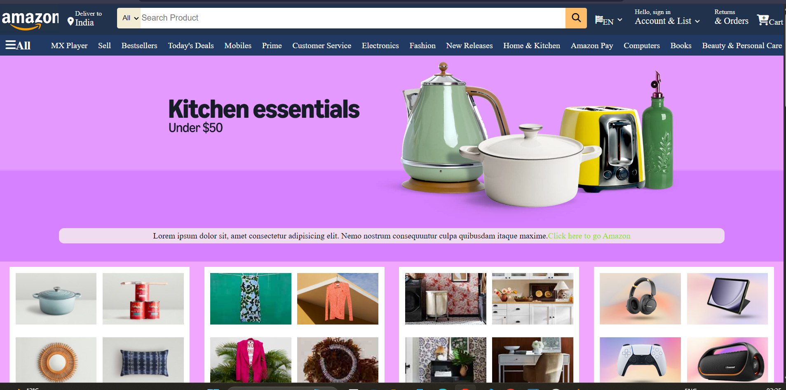
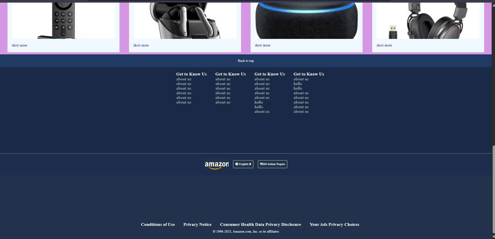

# Amazon Clone 🛒

This is my **first HTML & CSS project**, where I created a static clone of the Amazon website.  
The goal of this project was to practice **HTML structure**, **CSS styling**, and **page layout**.

---

## 📌 Features

- Amazon-like homepage design  
- Header with logo, search bar, and navigation  
- Product sections/cards  
- Footer similar to Amazon  
- Fully built using **only HTML and CSS**

---

## 🛠️ Technologies Used

- HTML5  
- CSS3  

---

## 📸 Preview




```md

